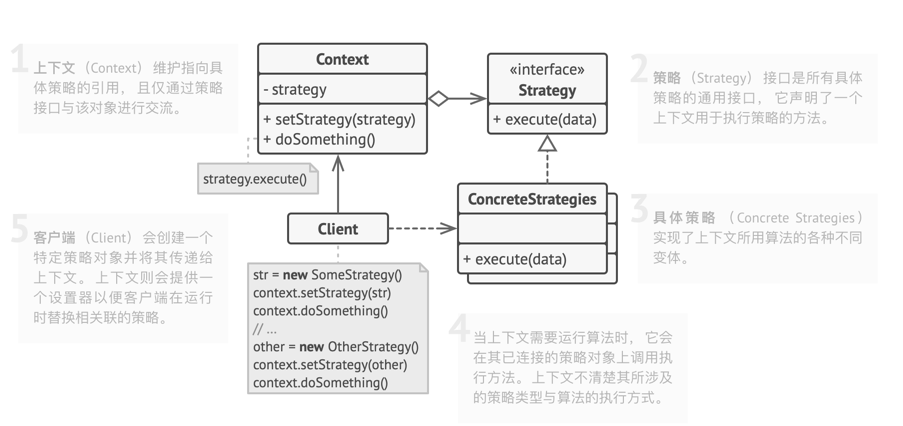
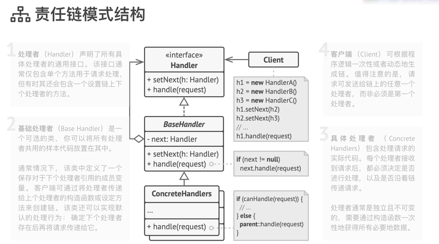

# 行为模式

## 策略模式

策略模式包含以下几个核心角色：
* 环境（Context）：维护一个对策略对象的引用，负责将客户端请求委派给具体的策略对象执行。环境类可以通过依赖注入、简单工厂等方式来获取具体策略对象。
* 抽象策略（Abstract Strategy）：定义了策略对象的公共接口或抽象类，规定了具体策略类必须实现的方法。
* 具体策略（Concrete Strategy）：实现了抽象策略定义的接口或抽象类，包含了具体的算法实现。

## 责任链模式
